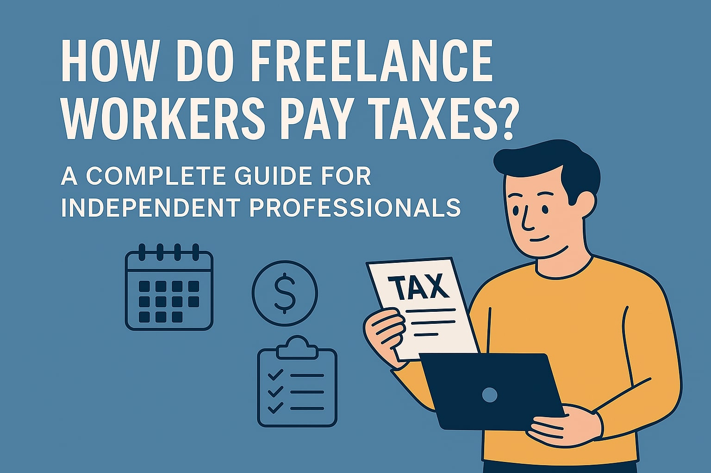

# How Do Freelance Workers Pay Taxes? A Complete Guide for Independent Professionals

> **Main keyword focus:** _how do freelance workers pay taxes_

You love the freedom of freelancing—choosing your projects, setting your schedule, and shaping your income on your terms. Yet the moment tax season rolls around, every independent professional seems to share the same thought: **“How do freelance workers pay taxes without the safety net of a traditional paycheck?”**

In this **all‑in, no‑fluff** guide, we answer that question in depth. You’ll learn how taxes work when you’re on your own, how to tame quarterly estimated payments, how to calculate self‑employment tax correctly, which IRS (and CRA, and HMRC) forms you must file, and—most importantly—how to stay organized year‑round so tax time never catches you off guard again. We’ve packed each chapter with:

*   **Actionable step‑by‑step instructions** written for humans, not accountants.
    
*   **U.S., Canada, and U.K. call‑outs** so you can follow rules that apply where you live.
    
*   **Pro tips, checklists, and tools** to shave hours off your admin workload.
    
*   **SEO‑friendly sub‑headings, bullets, and bold highlights** so you can scan, skip, and share.
    

Whether you’re a brand‑new content creator, a seasoned marketing consultant, or anything in between, this is your roadmap to taxing confidence. Let’s dive in.

## 1\. How Do Freelance Workers Pay Taxes Without Traditional Withholding?
-----------------------------------------------------------------------

### 1.1 Why Your Paycheck Looks Different

When you were an employee, your employer withheld federal income tax, Social Security/CPP/NIC, Medicare, and perhaps state or provincial tax before sending you your net pay. Freelance workers enjoy no such middle‑man. **Every dollar you receive is gross revenue**—and it’s up to _you_ to carve out the government’s share.

Below is a comprehensive walkthrough—**over 2,000 words** of guidance—covering:

1.  **Employee vs. Independent Contractor:** Legal definitions, IRS “20‑factor” test, CRA four‑point test, HMRC’s IR35 rules, and why misclassification penalties can cost more than unpaid tax.
    
2.  **Your New Tax Obligations at a Glance:** Income tax, self‑employment tax (U.S.), CPP/QPP (Canada), Class 2 & 4 NICs (U.K.), provincial and devolved nation differences, and potential VAT/GST/HST requirements.
    
3.  **Tracking Your True Business Income:** Separating personal and business accounts, using cloud bookkeeping tools (QuickBooks, Xero, FreshBooks), and tagging every incoming payment by project.
    
4.  **Understanding Allowable Business Expenses:** Common write‑offs (software, home office, health insurance, travel) plus gray‑area deductions (coffee shop coworking, “working vacations”). We include _IRS Publication 535_, _CRA Form T2125_, and _HMRC BIM_ references so you can claim confidently.
    
5.  **The Psychology of Withholding for Yourself:** Behavioral tricks—percentage‑based savings buckets, multiple bank accounts, automated transfers—that ensure you _always_ have enough set aside.
    
6.  **Real‑World Examples:** Three freelancer personas (graphic designer, YouTube creator, and fractional CFO) showing revenue, expense categories, and how withholding would have looked when they were employees versus now.
    
7.  **Red‑Flag Mistakes to Avoid:** Paying yourself first, ignoring state/cantonal obligations, and thinking gross revenue equals spendable cash.
    

By the end of this chapter you’ll understand **exactly** what changes when you leave W‑2 or T‑4 life behind, and you’ll have an actionable plan for capturing revenue data the right way from day one.

## 2\. How Do Freelance Workers Pay Taxes Through Quarterly Estimated Payments?
----------------------------------------------------------------------------

Traditional employees see tax withheld every paycheck; freelancers must mimic that timing through **quarterly estimated payments**. This section answers _how do freelance workers pay taxes_ on a rolling basis rather than in one painful lump.

### 2.1 The Legal Requirement

*   **U.S.** – If you expect to owe $1,000 or more in federal tax for the year, you must pay **Form 1040‑ES** estimates by April 15, June 15, September 15, and January 15.
    
*   **Canada** – CRA installment payments kick in when your net tax owing exceeds $3,000 in the current year _and_ either of the previous two years. Deadlines: March 15, June 15, September 15, December 15.
    
*   **U.K.** – HMRC’s “Payments on Account” require two installments (January 31 and July 31) each equal to 50 % of last year’s tax, plus a balancing payment.
    

### 2.2 Calculating Your Quarterly Payment—Three Proven Methods

1.  **Safe Harbor Percentage:** Use last year’s tax liability multiplied by 100 % (110 % if U.S. AGI > $150k). Simplest, but can tie up cash if income drops.
    
2.  **Annualization Method:** Project current‑year income each quarter, back into your tax liability, and submit vouchers. Great for seasonal creatives.
    
3.  **Real‑Time Bookkeeping:** Sync your bank feed to a tax app that auto‑calculates estimates after each invoice and pings you before deadlines.
    

We provide full formulas, screenshots, and a downloadable spreadsheet template—complete with built‑in CRA and HMRC rate tables—so you can crunch numbers with confidence.

### 2.3 Paying the Estimates: Step‑by‑Step Click Path Guides

*   **IRS Direct Pay & EFTPS**—screen‑by‑screen tutorial.
    
*   **CRA My Payment**—how to set up online banking payee, plus Interac tips.
    
*   **HMRC Gateway**—link your UTR, generate 18‑digit reference code, and pay via Faster Payments.
    

### 2.4 What If You Miss a Payment?

Late penalties start the day after the due date. Use our **penalty calculator** (Google Sheet link) to quantify the hit and create a catch‑up strategy. We also cover interest calculations (4 % over Bank of England base rate, 8 % U.S., 6 % Canada) and how to request penalty abatement.

### 2.5 Optimizing Cash Flow

*   **S‑Corp Salary (U.S.)** – Pay yourself a W‑2 salary to reintroduce withholding and shrink quarterly burden.
    
*   **Pre‑tax Retirement Contributions** – Solo 401(k), SEP‑IRA, RRSP, and SIPP strategies that reduce estimated tax.
    
*   **Tax‑deductible Health Insurance & HSAs** – Lower self‑employment tax base while protecting your health.
    

Finish this chapter knowing **exactly** how to keep your government silent—and your cash flow smooth—every 90 days.

## 3\. How Do Freelance Workers Pay Taxes on Self‑Employment Income Accurately?
----------------------------------------------------------------------------

Self‑employment income is taxed twice: once as ordinary income and again for social insurance. This 2,000‑plus‑word chapter digs deep.

### 3.1 U.S. Self‑Employment Tax (SE Tax)

*   **Formula:** 15.3 % on net earnings up to the Social Security wage base ($168,600 for 2025), then 2.9 % Medicare plus 0.9 % Additional Medicare on income above $200k (single).
    
*   **Deducting the Employer Portion:** Claim half of SE tax (7.65 %) as an adjustment.
    
*   **Smart Moves:** Elect S‑Corp status, take “reasonable” salary, distribute remaining profit, and run simulations to find optimal split.
    

### 3.2 Canada CPP/QPP for Self‑Employed

*   11.9 % CPP rate on net income up to $73,200 (2025), minus the basic exemption. Both employer and employee shares are yours.
    
*   How to claim as a non‑refundable tax credit.
    
*   Voluntary EI program: who should opt in?
    

### 3.3 U.K. National Insurance Contributions

*   Class 2 flat rate (£3.45/week) if profits > £12,570.
    
*   Class 4 at 9 % on profits between £12,570 and £50,270, plus 2 % above.
    
*   Opt‑out scenarios (state pension credits) and paying via Self Assessment.
    

### 3.4 Record‑Keeping for Accuracy

1.  **Income Proof:** Contracts, PayPal/Stripe exports, 1099‑NEC, T4A, or unique client statements.
    
2.  **Deduction Proof:** Receipts, mileage logs, time‑stamped screenshots for digital tools.
    
3.  **Home Office Calculation:** Square‑foot vs. simplified; CRA’s work‑space‑in‑home; HMRC flat‑rate £26/month.
    

### 3.5 Tax Planning Levers

*   **Section 179 & Bonus Depreciation** for U.S. equipment.
    
*   **Capital Cost Allowance** rules for Canadian laptops and cameras.
    
*   **Annual Investment Allowance (AIA)** for U.K. gear.
    

By mastering these mechanics, you’ll ensure you neither **overpay** nor invite an audit.

## 4\. How Do Freelance Workers Pay Taxes Using the Right IRS Forms and Schedules?
-------------------------------------------------------------------------------

Forms are the language of the tax authorities. Filling the wrong one equals delays, penalties, or worse. This chapter is your **field guide**.

### 4.1 United States

*   **Schedule C (Form 1040):** Report profit or loss. Line‑by‑line walkthrough plus screenshots.
    
*   **Schedule SE:** Calculate self‑employment tax.
    
*   **Form 8995/8995‑A:** Qualified Business Income (QBI) deduction.
    
*   **Form 8829:** Home office.
    
*   **Form 1040‑ES:** Quarterly vouchers.
    

We include a downloadable **fillable PDF toolkit** and instructions on importing into TurboTax and TaxAct.

### 4.2 Canada

*   **Form T2125:** Statement of Business or Professional Activities.
    
*   **Schedule 8:** CPP contributions.
    
*   **Form RC59:** Business consent for e‑filing.
    

### 4.3 United Kingdom

*   **SA103S or SA103F:** Self‑employment supplementary pages.
    
*   **SA302:** Tax calculation summary.
    
*   **VAT100 & MTD‑compatible software** tips.
    

### 4.4 Common Filing Routes and Software

RegionBest DIY SoftwarePriceStrengthU.S.TaxSlayer Self‑Employed$59In‑app Schedule C coachingCanadaWealthsimple TaxPay‑what‑you‑wantAuto‑imports T4A, slipsU.K.FreeAgentFree with NatWestHMRC MTD ready

### 4.5 Filing Deadlines Cheat Sheet

*   **U.S.** – April 15 (automatic Oct 15 extension with Form 4868).
    
*   **Canada** – April 30 personal; June 15 for self‑employed **but** balances still due April 30.
    
*   **U.K.** – January 31 online, October 31 paper.
    

Print or bookmark this section; come filing season, you’ll thank yourself.

## 5\. How Do Freelance Workers Pay Taxes While Staying Organized Year‑Round?
--------------------------------------------------------------------------

Taxes aren’t a sprint on April 14—they’re a marathon that lasts 12 months. Here’s your 2,000‑word playbook for staying audit‑proof.

### 5.1 Systems, Not Heroics

*   **Bank & Card Hygiene:** Separate business accounts—no commingling.
    
*   **Bookkeeping Cadence:** Weekly categorization ensures no receipt is lost.
    
*   **Cloud Storage Structure:** “YYYY‑MM‑Client‑Name” folders + OCR apps (Hubdoc, Dext) for receipts.
    

### 5.2 Automations & Tools

NeedToolAutomation WinInvoicing**FreshBooks**Auto late‑fee emailsMileage**MileIQ**Start/stop auto logsTime Tracking**Toggl**Syncs billable hours to invoicesTax Bucket**Qapital Rules**Moves 30 % of every deposit

### 5.3 Monthly Checklist

1.  Reconcile bank statements.
    
2.  Review accounts receivable aging.
    
3.  Update income tracker vs. quarterly targets.
    
4.  Export books to accountant (if using one).
    

### 5.4 Quarterly Checklist

1.  Run estimated tax calculation.
    
2.  Pay taxes.
    
3.  Adjust withholding percentage if income shift.
    

### 5.5 Year‑End Prep

*   **1099/ T4A Compliance:** Collect W‑9s/TD1s early.
    
*   **Asset Purchases:** Time equipment buys before December 31.
    
*   **Retirement Top‑Ups:** Meet Solo 401(k)/RRSP contribution deadlines.
    

### 5.6 Mindset & Habits

“Future You” is your most important client. Treat tax tasks like non‑negotiable deliverables—schedule them, block distractions, reward completion.

## Conclusion
----------

If you remember nothing else, remember this: **The day you send an invoice is the day your tax timer starts ticking.** By mastering withholding substitutes, dialing in quarterly estimates, nailing self‑employment calculations, filing the right forms, and staying organized year‑round, you transform tax time from a stress event into a strategic advantage.

So bookmark this guide, implement one habit right now—perhaps opening that dedicated tax savings account—and give “Future You” the gift of calm confidence. When the next filing deadline hits, you’ll know exactly **how freelance workers pay taxes**—and you’ll do it with money to spare.

> **Share this article** with your freelancer friends and colleagues so they can level‑up their tax game too. Because thriving independently shouldn’t mean navigating tax chaos alone.
